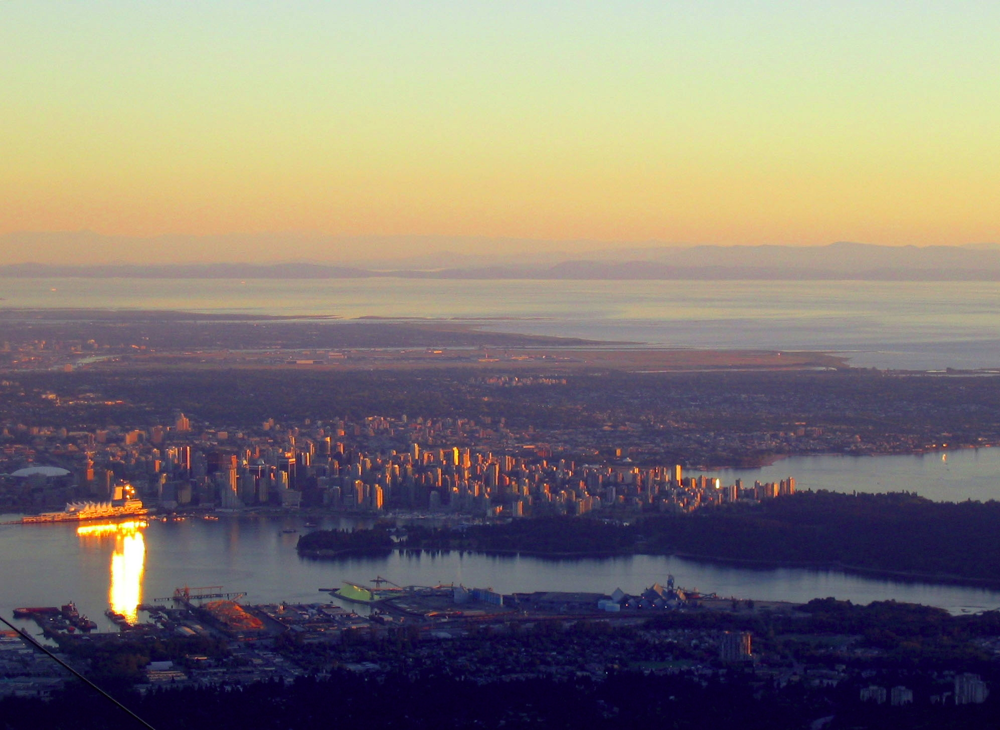

The Last Train
==============

.. image:: https://i.creativecommons.org/l/by/4.0/88x31.png
	:target: http://creativecommons.org/licenses/by/4.0/
	:alt: Creative Commons Attribution 4.0 International License

This work is licensed under a `Creative Commons Attribution 4.0 International License <http://creativecommons.org/licenses/by/4.0/>`_. All the images are from Wikipedia and link directly to the original.

Vancouver
---------

Adam rested his head against the pillow pressed into the side of his seat, enjoying its gentle comfort. The sun was setting over the horizon and the station lights were beginning to activate, one by one. Spread thinly around the platform, the passengers were loading their bags onto the train. Final farewells were being made. Kisses, hugs and handshakes.

Around him, they chose their seats carefully. Some were in groups; most were alone. Collectively they hoped they would get their destination on time and safely, but the quiet soft night almost seemed to guarantee that. Nothing could go wrong on the one night on which all were at rest.

Adam watched as the passengers arranged themselves: a lone man took a seat at the table across the aisle from him, a mother organised her three children around the table in front of his, another man lifted his two bags into a compartment further down the carriage and a woman found her place within a book.

He stared out to the evening, as temperatures began to plummet, appreciating the dimmed lights and quiet atmosphere of the train. He'd just finished reading the weather report, deriving just one simple fact. Snow was guaranteed. For other trains that might be a problem, but not for *this* train.

After a few minutes, an announcement by the driver broke the peace.

"Last call for ICR-471 leaving Vancouver." A brief pause. "This is the last train, you don't want to miss it."

Not long after the announcement, all of the doors locked automatically.

The driver's cheery voice burst out of the speakers for a second time. "This train is now leaving, onwards and outwards to our destinations. We're dimming the lights for your benefit; small lights are available above each seat if needed. We hope you enjoy the ride and wake up to a merry christmas on the other side."

There was a slight sensation as the train lifted upwards by the force of the magnetised rails. Then, slowly and subtly, it started to move. As promised, the lights dimmed until they were completely invisible and the darkness from outside entered the carriage, only withheld from completely filling it by the isolated glints of reading lights and computer screens.

Initially, Adam felt the train's acceleration push him back into his seat, but as it relieved he dropped into a serene deep sleep...

Edmonton
--------

.. image:: Edmonton.jpg
	:target: https://upload.wikimedia.org/wikipedia/commons/a/ac/Muttart_Conservatory_Skyline_Downtown_Edmonton_Alberta_Canada_01.jpg
	:align: center
	:width: 75%
	:alt: Edmonton

Adam woke calmly.

The carriage lights remained firmly switched off, but lights had appeared outside and the train had come to a halt.

Another station.

He immediately pulled his left arm from under the table and stared down at his watch, struggling to use the light from outside the train to see it. When he had finally discerned the time, he rotated himself and glared out the window.

A small group of passengers were again loading themselves onto the train, but he had apparently missed the goodbyes he had witnessed previously. Numerous individuals had appeared around the carriage and more were selecting their seats. By the looks of it, the train was preparing to leave.

He snatched another glance outside, firstly noticing the endless snow that had accumulated. Then he noticed the signs.

*Welcome to Edmonton*

He'd been here just three days earlier. A business meeting with two young gentlemen from a company called 'Marine Atlantic', who themselves were on a journey over to Newfoundland. During his brief visit he didn't find the time to tour its attractions.

Watching the new arrivals to the carriage keenly, Adam focused on a woman who was herself analysing her surroundings. He had observed, quite correctly, that the train was filling up. Whole tables were now unavailable and choosing a seat across a table facing someone was inevitable.

Counter-intuitively, his table near the beginning of the carriage was advantageous; many people passed him in pursuit of complete tables, only to find none and accept what they could find in their immediate surroundings. Adam desired to be alone, so that he could enjoy his activities, whether it would be sleeping, reading or working, without disturbance.

Adam's heart sank slightly as the woman took the seat opposite him. At the same time, he was grateful that she seemed to be alone, considering that groups had the potential to be much worse.

Realising her bag was too large to sit beside her, the woman returned to her feet and lifted it into the overhead compartment. Her bag was surprisingly small, considering the length of journey she was about to undertake. Then, following a brief smile in the direction of Adam, she slowly began to notice the identical pillows arranged around the cabin, but none on her seat.

Adam, observing her pillow had fallen under the table, picked it up and handed it to her.

"Thanks." She smiled gratefully.

Adam returned the smile as he opened the book next to him.

Meanwhile, the train advanced.

Saskatchewan
------------

.. image:: Saskatchewan.jpg
	:target: https://upload.wikimedia.org/wikipedia/commons/a/a5/Saskatchewan_River_Crossing.jpg
	:align: center
	:width: 75%
	:alt: Saskatchewan

The next stop after Edmonton was Nuuk, Greenland. The distance between them was approximately 3500 km, much more than 800 km from Vancouver to Edmonton, but the train would take just twice the amount of the time to cover the second leg of the journey.

Unfortunately, Adam thought, this implied some discomfort.

In order to achieve its estimates, the train would have to approach, and indeed exceed, around half of the speed of sound. Everyone was starting to feel the force of the train pushing them forwards, or as they probably perceived it, a force pushing them into their seats.

For the passengers facing Adam's direction, it was barely enough to wake them. However, as Adam observed, the woman opposite was finding herself unable to rest as her head was lifted away from her seat.

After less than ten minutes, the train had left Alberta and was ploughing through the Canadian province of Saskatchewan.

Adam noticed the woman opposite had stopped typing on her phone, and returned it to her pocket. For a short period she stared out the window into the darkness, until she took interest in the book Adam was reading, twisting her head to read the name plastered across the book's hinges.

Aware, and not particularly engrossed in the book itself, he raised his eyes.

"Sorry." She sat back in her seat.

At this point, feeling relaxed, Adam rotated the book so she could read the title. "Not an interesting read..." He smiled, which was promptly restituted.

"Do you sail?" Sitting back up, the woman gleaned what she could from the title.

Adam shaked his head from side to side determinedly. "Nope."

Smiling again, he clarified. "The company I work for is going to be designing some ships in the new year. Mostly passenger ferries."

The woman nodded, slightly interested.

"Anyway, this book helps me to avoid looking stupid."

The woman grinned. Then, she decided to introduce herself. "My name's Josie."

Glancing briefly back down at his book and then back towards her, he responded. "I'm Adam. So, Josie, where are you headed?"

"Oslo." Josie raised her head and focused on Adam. "And you?"

"London." Adam thought for a moment. "You don't sound Norwegian."

She shaked her head, smiling coyly. "No, I'm not. I mean, I grew up in Montreal with a foster family after my mother died, but it turns out my father lives in Oslo."

Adam was suddenly very interested, but careful to resist the perception of an interrogation. "You're meeting your father for the first time?"

She bit her lip and nodded slowly. "Well, we've had a few video chats. But yeah..."

Adam was empathetic. "I hope it goes well. A good christmas."

Josie smiled in appreciation, before mounting an interrogation of her own. "I assume you're British. What're you doing in Canada?"

"Business meetings." Adam stretched his mouth awkwardly, thinly spreading his lip. He was acutely aware his story was less interesting, so felt it necessary to twist the questions back. "You say you're based in Montreal...did you get a connection up to Edmonton?"

"Actually, I haven't been in Montreal since last Christmas; I've been travelling around a bit."

"Where did you go?"

"Ok, so I went off to Brazil at the start of this year, then I flew over to Japan, then China and finally New Zealand."

Adam's jaw dropped slightly, his interest peaked.

Meanwhile, the train advanced.

Hudson Bay
----------

The conversation between Adam and Josie continued for some time, covering a diverse array of topics.

Beyond the confines of the carriage the world was almost entirely invisible, except for the few stars, so it came as a surprise to the passengers when lights suddenly appeared outside, accompanied by a jolt as the train lifted up slightly.

Both Josie's and Adam's focus was caught by the sight of the lights flashing by rapidly, giving both of them a strong feeling of the speed of the train.

"We're travelling over Hudson Bay." Josie explained.

Adam nodded. "That's right."

"Oh, I'm sorry, I guess you've been on this train before."

"Many times."

